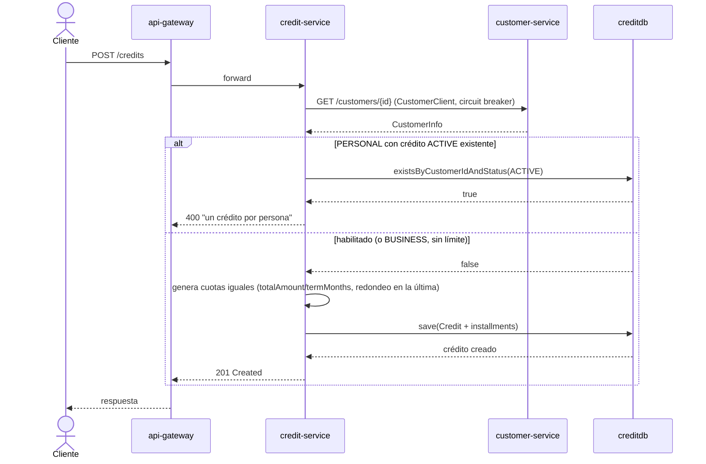
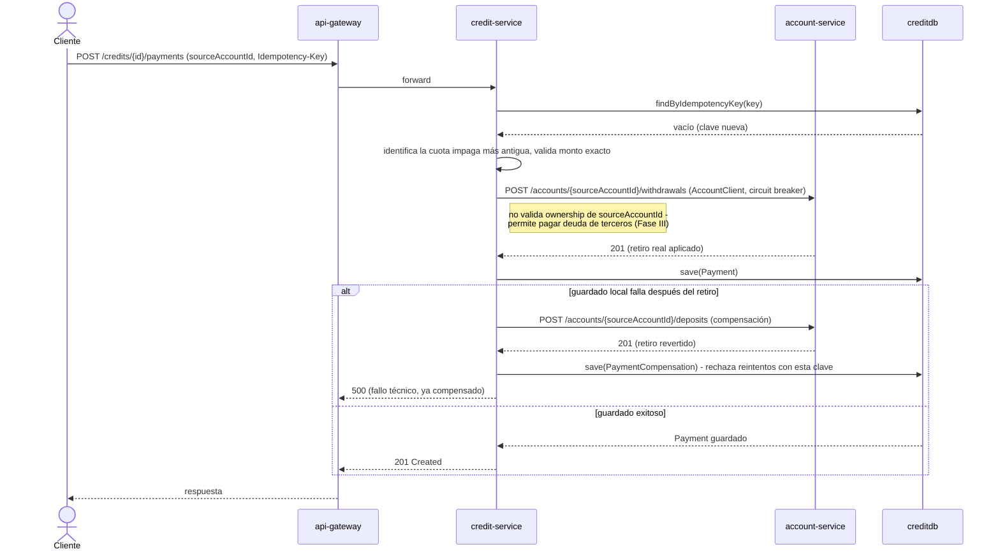
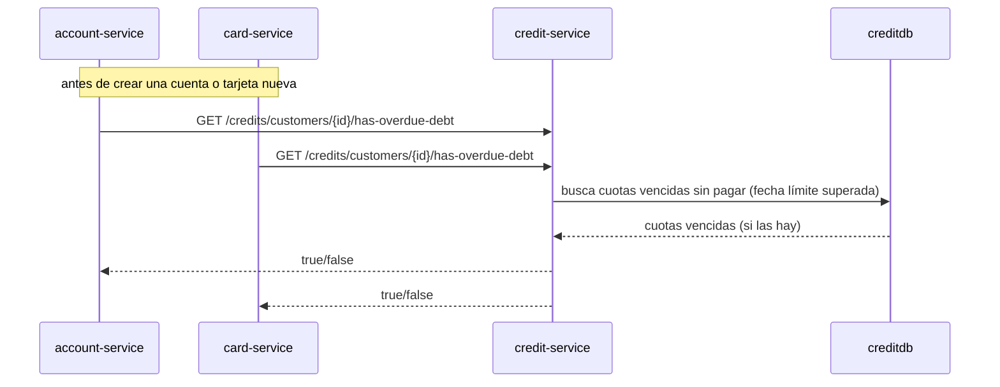

# Diagramas de secuencia — credit-service

Requerimiento no funcional (Parte I): *"Elaborar diagramas de secuencia de cada microservicio."*

## Alta de crédito (un crédito activo por persona)

## Pago de cuota (propia o de un tercero) con débito real en account-service

Primera Saga cross-servicio del proyecto vía REST síncrono: si el retiro en `account-service` ya
se aplicó pero el registro local del pago falla después, se compensa con un depósito de
reversión y se bloquea el reintento con la misma clave (`PaymentCompensation`) para no aplicar el
pago local "gratis" una segunda vez.

## Consulta de deuda vencida (bloqueo de productos nuevos, Fase III)

